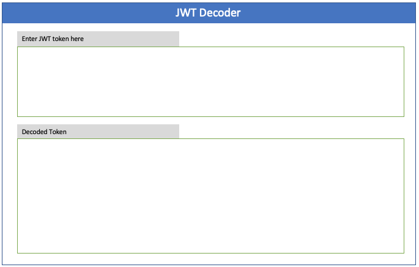

# JWT Decoder

A lightweight, interactive, and developer-focused JSON Web Token (JWT) decoder built with **Blazor WebAssembly**. This tool allows you to quickly inspect the header and payload of any JWT with a modern dark-mode aesthetic.

## 🚀 Features

- **Real-time Decoding:** Automatically decodes your JWT as you paste it.
- **Collapsible JSON Viewer:** Interactive tree view for exploring nested JSON objects and arrays.
- **Developer Dark Mode:** A sleek, high-contrast UI designed for long-term use.
- **Syntax Highlighting:** Color-coded JSON keys and values for better readability.
- **Privacy Focused:** All decoding happens locally in your browser. Your tokens are never sent to a server.

## 🛠️ Tech Stack

- **Framework:** [Blazor WebAssembly](https://dotnet.microsoft.com/en-us/apps/aspnet/web-apps/blazor) (.NET 10)
- **Styling:** [Bootstrap 5](https://getbootstrap.com/)
- **Icons:** [Bootstrap Icons](https://icons.getbootstrap.com/)

## 📸 Screenshots

### Main Interface

*The modern dark-themed interface with input area and side-by-side decoded results.*

### Collapsible JSON
*Interactive nodes allow you to drill down into complex claims and nested data structures.*

## 📖 How to Use

### 1. Paste your Token
Copy your encoded JWT and paste it into the **"Encoded Token"** text area at the top of the page.

### 2. Inspect the Header
The left panel immediately populates with the decoded **Header**, showing the algorithm (`alg`) and token type (`typ`).

### 3. Explore the Payload
The right panel displays the **Payload** (claims). If your payload contains nested objects or large arrays:
- Click the **▶ (Chevron)** next to an object `{ ... }` or array `[ ... ]` to expand it.
- Click the **▼ (Chevron)** to collapse it back.

### 4. Handle Errors
If the token is malformed or invalid, a clear error message will appear above the results to help you troubleshoot.

---

## 🏗️ Development

### Prerequisites
- [.NET 10 SDK](https://dotnet.microsoft.com/download/dotnet/10.0)

### Running Locally
1. Clone the repository.
2. Navigate to the project folder.
3. Run the following command:
   ```bash
   dotnet watch run
   ```
4. Open your browser to `http://localhost:5000` (or the port specified in the console).

---
*Built with ❤️ for developers.*
